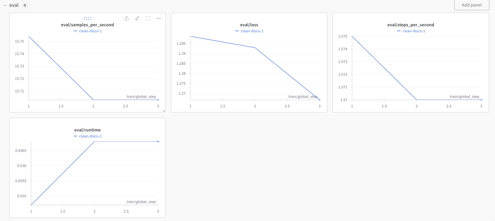

# Modifying llm-finetune Example

As part of the Mastering LLMs Conference that I'm attending, I fine-tuned my first model! Using credits provided by [Modal](https://www.modal.io) and following their [LLM Fine Tuning example guide](https://modal.com/docs/examples/llm-finetuning), I was able to get it running.

The next step I wanted to take was to modify the course example, available at this [GitHub repo](https://github.com/parlance-labs/ftcourse), to run in Modal.

tl;dr after a bit of trial and error, it was easy to get running!

### Weights and Biases

In the existing config, there was a section for `wandb` setup. I signed up for an account and modified my local run to be:

```
ALLOW_WANDB=true modal run --detach src.train
```

During that run, I received an error:

```
wandb: ERROR It appears that you do not have permission to access the requested resource. Please reach out to the project owner to grant you access. If you have the correct permissions, verify that there are no issues with your networking setup. (Error 403: Forbidden)
```

The fix was to remove the `wandb_entity` key and, from the Modal docs, add `wandb_watch: gradients`.

{ width="500" }

### Diff for ftcourse

I commented out the `dataset_prepared_path` as I wasn't sure if it was going to be needed. Additionally, I did not want to upload the model to HuggingFace, so I removed that line.

```diff
diff --git a/hc.yml b/hc.yml
index a57b51f..d8e9c73 100644
--- a/hc.yml
+++ b/hc.yml
@@ -12,13 +12,12 @@ data_seed: 49
 seed: 49
 
 datasets:
-  - path: sample_data/alpaca_synth_queries.jsonl
+  - path: data.jsonl
     type: sharegpt
     conversation: alpaca
-dataset_prepared_path: last_run_prepared
+#dataset_prepared_path: last_run_prepared
 val_set_size: 0.1
 output_dir: ./qlora-alpaca-out
-hub_model_id: hamel/hc-mistral-alpaca
 
 adapter: qlora
 lora_model_dir:
@@ -41,8 +40,8 @@ lora_target_modules:
   - k_proj
   - o_proj
 
-wandb_project: hc-axolotl-mistral
-wandb_entity: hamelsmu
+wandb_project: hc-axolotl-test
+wandb_watch: gradients
 
 gradient_accumulation_steps: 4
 micro_batch_size: 16
```

The following command was run from the `llm-finetuning` directory:

```
ALLOW_WANDB=true modal run --detach src.train --config=/path/to/ftcourse/hc.yml --data=path/to/ftcourse/sample_data/alpaca_synth_queries.jsonl
```

### Conclusion

I was able to complete the runs and use the inference API to interact with the model.

The model's response was not exactly what I was hoping for, but I learned a lot!

> 👤: Honeycomb is an observability platform that allows you to write queries to inspect trace data. You are an assistant that takes a natural language query (NLQ) and a list of valid columns and produces a Honeycomb query.

> **Instruction:**
> NLQ: 'Exception count by exception and caller'

> **Columns:** ['error', 'exception.message', 'exception.type', 'exception.stacktrace', 'SampleRate', 'name', 'db.user', 'type', 'duration_ms', 'db.name', 'service.name', 'http.method', 'db.system', 'status_code', 'db.operation', 'library.name', 'process.pid', 'net.transport', 'messaging.system', 'rpc.system', 'http.target', 'db.statement', 'library.version', 'status_message', 'parent_name', 'aws.region', 'process.command', 'rpc.method', 'span.kind', 'serializer.name', 'net.peer.name', 'rpc.service', 'http.scheme', 'process.runtime.name', 'serializer.format', 'serializer.renderer', 'net.peer.port', 'process.runtime.version', 'http.status_code', 'telemetry.sdk.language', 'trace.parent_id', 'process.runtime.description', 'span.num_events', 'messaging.destination', 'net.peer.ip', 'trace.trace_id', 'telemetry.instrumentation_library', 'trace.span_id', 'span.num_links', 'meta.signal_type', 'http.route']

> **Response:**
> 🤖: 
```
from honeycomb import Client, Query

client = Client(api_key='YOUR_API_KEY')
query = Query('''
    from error
    group by error
    count() as count
''')
response = client.run_query(query)
print(response.json())
```